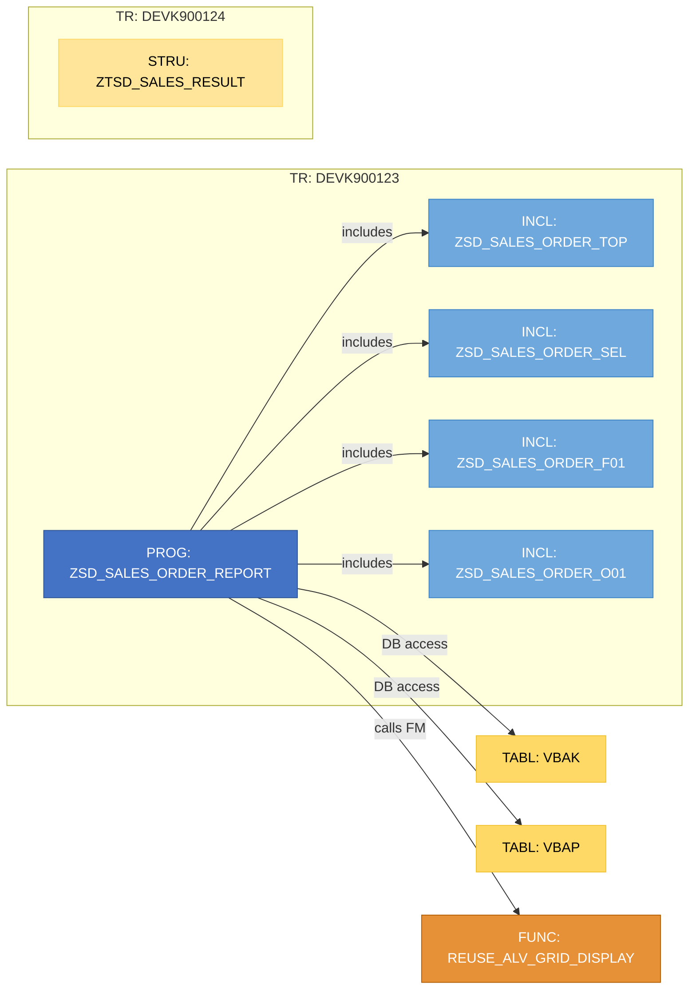
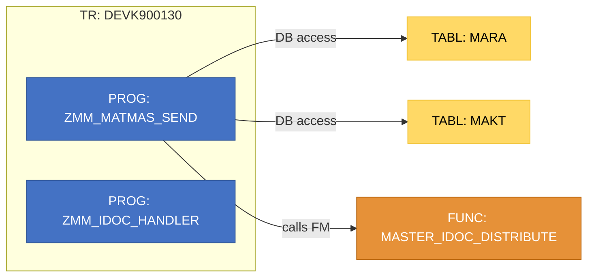
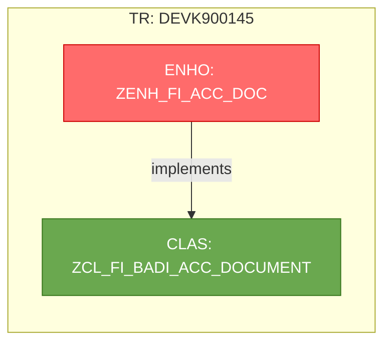

# WRICEF Technical Specification — Sample Output

> Generated by: `GenerateWricefTechSpec` tool.
> This file demonstrates all six WRICEF types with their type-specific sections and a Mermaid object relationship diagram.
> Sections are controlled via `tech-spec-config.json`.

---

---

# Technical Specification
## R — Report — ZSD-R-001

---

## Document Information

| Field | Value |
| --- | --- |
| Document Title | Technical Specification — ZSD-R-001 |
| WRICEF ID | ZSD-R-001 |
| WRICEF Type | R — Report |
| Complexity | M |
| SAP System | DEV |
| Client | 100 |
| Document Version | 1.0 |
| Created Date | 2025-01-15 |
| Transport Number(s) | DEVK900123, DEVK900124 |

## Developer Information

| Role | Name | User ID |
| --- | --- | --- |
| Developer | John Smith | JSMITH |
| Reviewer | Mary Johnson | — |
| Approver | Peter Müller | — |

## Change Request Reference

| Field | Value |
| --- | --- |
| CR / Ticket Number | CHG0012345 |
| Business Justification | _(to be filled)_ |
| Linked Documents | _(functional spec, BRD link)_ |

## WRICEF Classification

| Field | Value |
| --- | --- |
| WRICEF Category | R — Report |
| Complexity | M |
| Estimated Effort | 5 days |
| Module / Functional Area | SD — Sales & Distribution |

## Transport Request Details

| Property | Value |
| --- | --- |
| Transport Number | DEVK900123 |
| Description | SD — Sales Order Report Enhancement |
| Owner / Requestor | JSMITH |
| Status | D |
| Category | Workbench Request |

| Property | Value |
| --- | --- |
| Transport Number | DEVK900124 |
| Description | SD — Sales Order Report — Dictionary Objects |
| Owner / Requestor | JSMITH |
| Status | D |
| Category | Workbench Request |

## Transport Contents

| # | Object Name | Type | Transport | Description |
| --- | --- | --- | --- | --- |
| 1 | `ZSD_SALES_ORDER_REPORT` | PROG | DEVK900123 | Sales Order Report |
| 2 | `ZSD_SALES_ORDER_TOP` | INCL | DEVK900123 | Top Include |
| 3 | `ZSD_SALES_ORDER_SEL` | INCL | DEVK900123 | Selection Screen Include |
| 4 | `ZSD_SALES_ORDER_F01` | INCL | DEVK900123 | Subroutines Include |
| 5 | `ZSD_SALES_ORDER_O01` | INCL | DEVK900123 | ALV Events Include |
| 6 | `ZTSD_SALES_RESULT` | STRU | DEVK900124 | Sales Result Structure |

## Business Requirement

Sales Order Report — Lists open sales orders filtered by customer, date range, and sales organization.
Provides real-time visibility into pending deliveries and overdue items for the SD controlling team.

**Functional Specification Reference:** SD-FS-2024-042

## Scope & Assumptions

**In Scope:**
- Display open sales orders per sales org / customer / date range
- Show net value, delivery status, overdue flag

**Out of Scope:**
- Automatic email distribution
- Integration with BW reporting

**Assumptions:**
- User has access to transaction VA05
- Data available in VBAK / VBAP

**Dependencies:**
- REUSE_ALV_GRID_DISPLAY available in target system

## Technical Design Overview

**Object(s):** `ZSD_SALES_ORDER_REPORT` (PROG), `ZSD_SALES_ORDER_TOP` (INCL), `ZSD_SALES_ORDER_SEL` (INCL), `ZSD_SALES_ORDER_F01` (INCL)

**Object Types involved:** PROG, INCL, STRU

**Approach:** Classic ABAP report using modularized includes. Data is read from VBAK/VBAP and displayed using ALV Grid. Selection screen filters by customer, sales org, and date range.

## Selection Screen / Input Parameters

| Parameter | Kind | Definition |
| --- | --- | --- |
| `KUNNR` | PARAMETERS | TYPE KUNNR |
| `VKORG` | PARAMETERS | TYPE VKORG OBLIGATORY DEFAULT '1000' |
| `WAERS` | PARAMETERS | TYPE WAERS DEFAULT 'EUR' |
| `DATUV` | SELECT-OPTIONS | For SY-DATUM |
| `DATUB` | SELECT-OPTIONS | For SY-DATUM |

## Output / ALV Layout

**Output Type:** ALV Grid (REUSE_ALV_GRID_DISPLAY)

| Column / Field | Data Element | Description |
| --- | --- | --- |
| VBELN | VBELN_VA | Sales Document Number |
| KUNNR | KUNNR | Customer Number |
| ERDAT | ERDAT | Creation Date |
| NETWR | NETWR | Net Value |
| WAERK | WAERK | Currency |
| DELIVERY_STATUS | — | Open / Partial / Complete |
| OVERDUE | — | Overdue flag (X / space) |

## Processing Logic (Pseudocode)

**PROG / ZSD_SALES_ORDER_REPORT**

```
BEGIN ZSD_SALES_ORDER_REPORT
  INITIALIZATION
    SET default values for selection screen

  AT SELECTION-SCREEN
    CALL FUNCTION 'CONVERSION_EXIT_ALPHA_INPUT' IMPORTING kunnr ...

  START-OF-SELECTION
    SELECT SINGLE * FROM t001 WHERE bukrs = p_bukrs
    IF SY-SUBRC <> 0 THEN
      MESSAGE 'Company code not found' TYPE 'E'
    END IF

    PERFORM GET_SALES_ORDERS
      SELECT vbeln, kunnr, erdat, netwr, waerk
        FROM vbak INTO TABLE lt_vbak
        WHERE vkorg = p_vkorg AND erdat IN s_datuv
      IF SY-SUBRC <> 0 THEN
        MESSAGE 'No sales orders found' TYPE 'W'
        LEAVE LIST-PROCESSING
      END IF
      FOR EACH ls_vbak IN lt_vbak DO
        SELECT posnr, matnr, kwmeng, vrkme
          FROM vbap INTO TABLE lt_vbap
          WHERE vbeln = ls_vbak-vbeln
      END FOR
    END PERFORM

    PERFORM APPLY_FILTERS
    PERFORM CALCULATE_TOTALS
    PERFORM BUILD_FIELDCAT
    PERFORM DISPLAY_ALV
      CALL FUNCTION 'REUSE_ALV_GRID_DISPLAY'
        EXPORTING it_fieldcat = lt_fieldcat
        TABLES    t_outtab    = lt_vbak
    END PERFORM

END ZSD_SALES_ORDER_REPORT
```

## Database Objects Used

| Table / View | Access Type | Description |
| --- | --- | --- |
| `VBAK` | SELECT | Sales Document Header |
| `VBAP` | SELECT | Sales Document Item |
| `VBUP` | SELECT | Sales Document Item Status |
| `KNA1` | SELECT | Customer Master |
| `T001` | SELECT | Company Codes |

## Called Function Modules / BAPIs / Methods

| Name | Type | Purpose |
| --- | --- | --- |
| `REUSE_ALV_GRID_DISPLAY` | Function Module | Display ALV grid output |
| `LVC_FIELDCATALOG_MERGE` | Function Module | Build field catalog |
| `CONVERSION_EXIT_ALPHA_INPUT` | Function Module | Customer number conversion |
| `POPUP_TO_CONFIRM` | Function Module | Confirm user action |

## Authorization Objects

| Authorization Object | Field / Activity | Description |
| --- | --- | --- |
| `V_VBAK_VKO` | VKORG, ACTVT | Sales organisation authorisation |
| `V_VBAK_AAT` | AUART | Sales document type authorisation |

## Error Handling

| Scenario / Pattern | Handling Strategy |
| --- | --- |
| `IF SY-SUBRC <> 0` (T001 read) | Terminate with error message |
| `IF SY-SUBRC <> 0` (VBAK read) | Warning + leave list processing |
| `MESSAGE … TYPE 'E'` | Standard ABAP message handling |

## Performance Considerations

- `SELECT *` detected — consider selecting only required fields.
- `SELECT` inside `LOOP` on VBAP — evaluate using JOIN or FOR ALL ENTRIES.

## Test Scenarios

| # | Test Case | Input / Condition | Expected Result | Status |
| --- | --- | --- | --- | --- |
| 1 | Positive scenario | Valid VKORG + date range | ALV list displayed | ⬜ Pending |
| 2 | No data found | Future date range | Warning message | ⬜ Pending |
| 3 | Boundary / edge case | Max customer range | No dump | ⬜ Pending |
| 4 | Authorization check | User without V_VBAK_VKO | Auth error | ⬜ Pending |
| 5 | Performance / volume test | 100,000+ orders | Response < 30s | ⬜ Pending |

## Additional Notes

Report uses classic ABAP modularization. Future refactoring to OOP ALV recommended.

## Object Relationship Diagram



## Change History

| Version | Date | Changed By | User ID | Description |
| --- | --- | --- | --- | --- |
| 1.0 | 2025-01-15 | John Smith | JSMITH | Initial version |

## Sign-off

| Role | Name | Date | Signature |
| --- | --- | --- | --- |
| Developer | John Smith | | |
| Reviewer | Mary Johnson | | |
| Approver | Peter Müller | | |

---

---

# Technical Specification
## I — Interface — ZMM-I-001

---

## Document Information

| Field | Value |
| --- | --- |
| Document Title | Technical Specification — ZMM-I-001 |
| WRICEF ID | ZMM-I-001 |
| WRICEF Type | I — Interface |
| Complexity | L |
| SAP System | DEV |
| Client | 100 |
| Document Version | 1.0 |
| Created Date | 2025-01-15 |
| Transport Number(s) | DEVK900130 |

## Developer Information

| Role | Name | User ID |
| --- | --- | --- |
| Developer | Alice Weber | AWEBER |
| Reviewer | Bob Müller | — |
| Approver | — | — |

## Interface Details

| Property | Value |
| --- | --- |
| Direction | Outbound |
| Protocol | IDoc / MATMAS |
| Frequency | Event-driven (material master change) |
| Source System | SAP ECC DEV |
| Target System | External WMS |
| Error Handling Strategy | Application log (SLG1) + email alert |

## Message Structure / Field Mapping

| Source Field | Source Type | Target Field | Target Type | Transformation / Note |
| --- | --- | --- | --- | --- |
| MARA-MATNR | MATNR | material_id | String(18) | ALPHA conversion |
| MARA-MATKL | MATKL | category_code | String(9) | Direct mapping |
| MARA-MEINS | MEINS | base_uom | String(3) | ISO conversion via T006A |
| MAKT-MAKTX | MAKTX | description | String(40) | Language EN only |

## Object Relationship Diagram



## Change History

| Version | Date | Changed By | User ID | Description |
| --- | --- | --- | --- | --- |
| 1.0 | 2025-01-15 | Alice Weber | AWEBER | Initial version |

## Sign-off

| Role | Name | Date | Signature |
| --- | --- | --- | --- |
| Developer | Alice Weber | | |
| Reviewer | Bob Müller | | |
| Approver | — | | |

---

---

# Technical Specification
## E — Enhancement — ZFI-E-001

---

## Document Information

| Field | Value |
| --- | --- |
| Document Title | Technical Specification — ZFI-E-001 |
| WRICEF ID | ZFI-E-001 |
| WRICEF Type | E — Enhancement |
| Complexity | S |
| SAP System | DEV |
| Client | 100 |
| Document Version | 1.0 |
| Created Date | 2025-01-15 |
| Transport Number(s) | DEVK900145 |

## Enhancement Point Details

| Property | Value |
| --- | --- |
| Enhancement Type | BAdI |
| Enhancement Name | BADI_ACC_DOCUMENT |
| Original Program | SAPLGL_ACCOUNT_ASSIGNMENT |
| Impact on Standard | No modification; BAdI implementation only |
| Activation Required | Yes |

## Processing Logic (Pseudocode)

**CLAS / ZCL_FI_BADI_ACC_DOCUMENT**

```
BEGIN ZCL_FI_BADI_ACC_DOCUMENT (implements IF_EX_BADI_ACC_DOCUMENT)
  METHOD CHANGE_DOCUMENT
    IF i_account_type = 'K' THEN
      READ TABLE it_account_assignment WITH KEY ... INTO ls_acc
      IF ls_acc-kostl IS INITIAL THEN
        RAISE EXCEPTION TYPE cx_fi_missing_cost_center
          EXPORTING message = 'Cost center required for vendor postings'
      END IF
    END IF
    CALL METHOD super->change_document( ... )
  END METHOD
END ZCL_FI_BADI_ACC_DOCUMENT
```

## Object Relationship Diagram



## Change History

| Version | Date | Changed By | User ID | Description |
| --- | --- | --- | --- | --- |
| 1.0 | 2025-01-15 | Priya Sharma | PSHARMA | Initial version |

## Sign-off

| Role | Name | Date | Signature |
| --- | --- | --- | --- |
| Developer | Priya Sharma | | |
| Reviewer | — | | |
| Approver | — | | |
